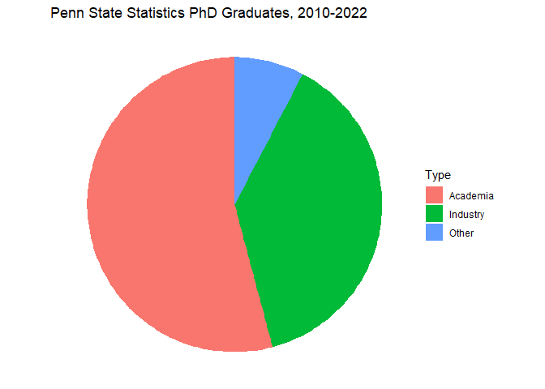
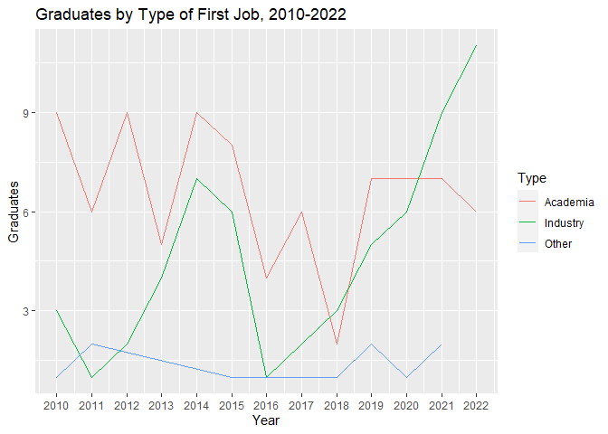

*A version of this article was originally written in 2019. Now that I’ve
graduated and as part of moving my website to Hashnode I decided to
revisit this analysis with data through Summer 2022.*

When I was a statistics PhD student, I was often asked what I intended
to do after I graduate. After I’d give my answer, the next natural
question was “where do PhD students from your department usually go
after they graduate?” This question also came up every year when
prospective students visited our department.

In the past, my answer to that second question was that 1/3rd of our
graduates went to academia, 1/3rd went into industry, and roughly 1/3rd
went into what could loosely be defined as “other,” which are jobs that
are not quite academia but also not industry either, such as those at a
national lab, a government agency, or a think tank like the RAND
Corporation. This was more of a guess than anything based on real data,
mostly because while we do have a webpage with where our alumni go after
they graduate (<https://science.psu.edu/stat/alumni/members>), that
information is not in a format that’s easily analyzable.

Nonetheless, I do actually want the answer to this question. Part of
this is so that I can actually give a good answer to prospective
students (or other people who are curious), and part of it is just to
satisfy my own curiosity. I recently spent some time organizing the
available data into a more manageable CSV file so that I can finally
answer the question of where Penn State statistics PhD graduates go.

### The Data

All of the data was taken off of the website link above for graduates
from 2010 until 2022. Previously, I had chosen 2010 as a cutoff because
data from before 2010 seemed more incomplete, and I thought that data
from before 2010 wouldn’t be representative of recent trends in the
department. Of course, now we have more recent data, but since I already
collected the previous data, I’m keeping it.

### Limitations of the Data

There are a few limitations from this dataset that are worth noting:

-   This data only includes up to people who would graduate in the 2022
    calendar year: some individuals might defend their dissertation in
    the Fall 2022 semester, but as of this publication date nobody has
    announced or defended yet this semester, and anyone defending after
    today will only be eligible to graduate in Spring of 2023.
-   The information about first jobs is self-reported by the people
    graduating. In the case of some individuals not publicly listed, I
    have used personal recollection and some searches to find their
    first post-graduation job.
-   Only people who graduated with a PhD are included in this dataset.
    People sometimes withdrew or graduated with a Master’s for a variety
    of reasons, but this analysis is focused on PhD graduates due to
    them making up the overwhelming number of people who graduate from
    the PhD program.
-   A couple of PhD graduates were excluded from the analysis because no
    job information was provided nor could be found online.

Overall, this meant that I had information on 157 graduates and the
first jobs and institutions they went to.

All of the data as well as the RMarkdown file (with the R code) can be
found here: <https://github.com/yazhao/PSUPhdGrads>

### Definitions

For the purposes of this analysis, I looked only at the first job taken
by graduates right after they got their PhD. It’s entirely possible that
many of these people switched career tracks, but tracking down that full
information proved to be difficult. Additionally, I’m mostly interested
in where people are *first* placed, not necessarily where they
ultimately end up. I wanted to see what the immediate next step of a
Penn State statistics PhD would be. The three categories of jobs were:

**Academia**: This includes any job working at an academic institution
like a university. It also included any first job where the title would
imply postdoc (ie “postdoctoral researcher”). This was an overly broad
definition, and so I included people who weren’t strictly on a
tenure-track assistant professorship, but rather anyone who got a job in
an academic setting.

**Industry**: Anyone who went to work at a private company was put into
this category.

**Other**: This included jobs and institutions that weren’t necessarily
academia but also clearly were not industry. In this category included
working at a government agency, a national lab, central banks, and
non-profit think tanks.

In the cases where I didn’t have a first job title, I used the first job
location to define the job type.

### Summary

    ## 
    ## Academia Industry    Other 
    ##    54.14    38.22     7.64

Based on the past 13 years worth of data, it seems that the majority of
our PhD graduates go into academia. Over 50 percent of our graduates end
up in academia with their first job, a little under 40 percent go into
private industry, while only about 7.5 percent go into that Other
category. It seems that my initial impressions (and the answer I’ve been
giving people) were wrong. And while these numbers might be inflated due
to my broad definition of an academic job, it seems that our department
largely prepares people for academia.

### Trends

I was curious to see if the trends behind these first jobs had changed
over the time of the dataset. Was this pattern of mostly academic jobs
relatively consistent, or have there been changes in the composition of
jobs over time?

It seems like there has definitely been changes in the category
compositions over time. Initially, basically all graduates went into
academia. However, around 2013, that trend started shifting, as more
students went into industry. That trend reversed in 2016, though that
change was mostly because of people going into the Other category. By
2018, it was a roughly even split between academia and industry
positions, and since 2021 the number of people going into industry jobs
has exceeded those going into academia. People going into “other” jobs
has all but fallen off in that timeframe.

### Conclusion

My intuition that the department was roughly evenly split among the
three types of jobs for graduates was obviously incorrect. Most of my
mistake was in overestimating the share of people going into research
positions in the Other category, possibly partly due to the people I
knew when I was starting in the program. Based on historical data, the
academic/industry/other split is approximately 50/40/10. In recent
years, however, that trend has been changing, and post-2020 it’s been
more 50/50 academia/industry, with “other” jobs falling off. Moreover,
it looks like after 2020 the trend has been towards a 60/40 split
between industry and academic jobs, respectively.

This updated analysis also further solidifies the trend that I initially
saw in 2018: while the initial percent of people going to academia
recovered from the one-time 2018 dip, it’s now the case that industry
jobs are more popular than academic ones for students from Penn State’s
statistics department.

Of course, this kind of analysis has a lot of caveats. It’s possible
that people going into industry might not be as interested in filling
out this information, or people going into jobs that they don’t
particularly like. It’s also possible that a lot of the people who first
get an academic job (notably, many of those who are lecturers or
postdocs) might end up switching tracks and going into industry or some
other type of job, while the reverse trend might be much less common.

Nonetheless, this information does seem to capture a trend: while in the
past most graduates first went into academic jobs, it seems like more
and more statistics PhD students at Penn State are willing to jump into
industry first. In any case, at least now I have a more accurate answer
to the question of “Where do Penn State statistics PhD students go after
they graduate?” the next time somebody asks.
